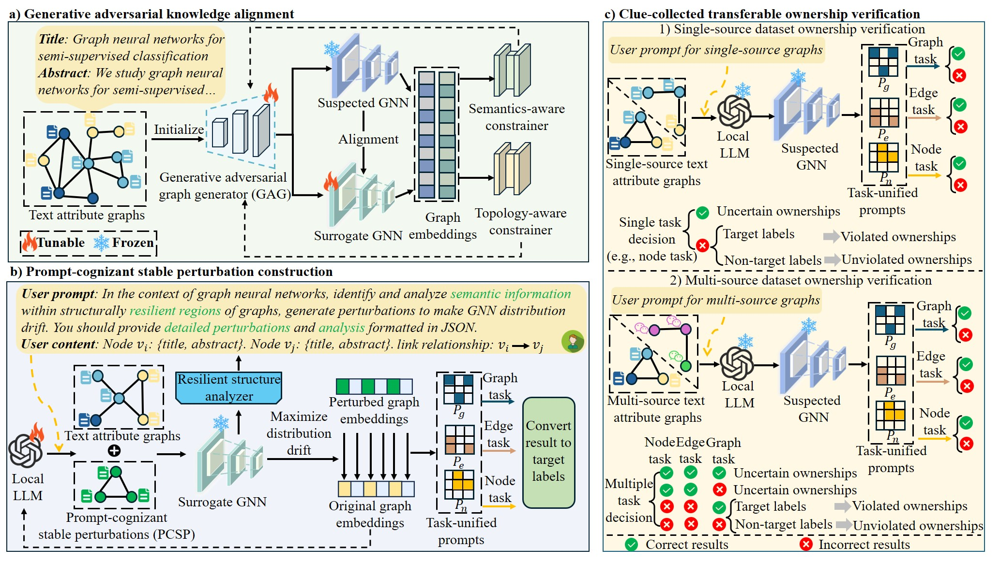

# TAGFinger

**TAGFinger: Semantic-Prompted Structural-Resilient Fingerprinting for Universal Ownership Verification of Text-Attribute Graphs**

TAGFinger is a **non-intrusive dataset ownership verification framework** for **Text-Attributed Graphs (TAGs)**.  
It leverages **LLM-generated prompt-cognizant stable perturbations** and **task-unified graph prompts** to extract transferable fingerprints that remain effective across **multiple datasets, tasks, and GNN architectures**.

This repository provides the official implementation of TAGFinger, including surrogate model alignment, LLM-based perturbation generation, and universal verification protocols.

---

## 🔍 Motivation

Text-attributed graphs are expensive to collect and curate, yet they are increasingly reused without authorization.  
Existing dataset ownership verification methods often:

- Depend on **task-specific triggers**
- Fail under **multi-source training**
- Break when **task or architecture changes**

TAGFinger addresses these limitations by extracting **semantic–structural fingerprints** that are:

- **Task-agnostic**
- **Model-agnostic**
- **Robust to distribution drift**
- **Transferable across tasks and domains**

---

## ✨ Key Features

- **Prompt-Cognizant Stable Perturbations**
  - LLM-generated textual perturbations anchored in structurally resilient regions
- **Task-Unified Prompts (TUP)**
  - Unified verification across node-, edge-, and graph-level tasks
- **Generative Adversarial Knowledge Alignment**
  - Surrogate GNN approximates the decision boundary of a black-box suspected model
- **Non-Intrusive Verification**
  - No modification to the original dataset or training pipeline
- **High Robustness**
  - Resistant to pruning, backdoor removal, and adaptive attacks

---

## 🧠 Method Overview

TAGFinger consists of three main stages:

1. **Generative Adversarial Knowledge Alignment**
   - Train a surrogate GNN to mimic the suspected model’s decision boundary
2. **Prompt-Cognizant Stable Perturbation Construction**
   - Identify structurally resilient regions
   - Use a fine-tunable LLM to generate semantic-preserving perturbations
3. **Clue-Collected Transferable Verification**
   - Aggregate fingerprint responses across unified tasks to confirm ownership

<p align="center">
  
</p>

---

## 📁 Repository Structure

```text
TAGFinger/
├── data/          # Dataset storage (Cora-ML, CiteSeerML, Reddit, etc.)
├── evaluation/    # Evaluation scripts (VSR, robustness, transferability)
├── images/        # Experimental figures and schematics
├── llm/           # LLM configurations (prompt templates, perturbation generation)
├── model/         # GNN model definitions (GCN/GAT/GIN/RGCN) and surrogate training
├── pretrain/      # Pretrained model weights
├── prompt/        # Task-Unified Prompt (TUP) templates
├── tasker/        # Task processing modules (node/edge/graph-level task adaptation)
├── utils/         # Utility functions (data preprocessing, metric calculation, config)
├── clean_data.py  # Data cleaning and format conversion script
├── ours.py        # Main running script (fingerprint generation, verification pipeline)
└── README.md      # Project documentation