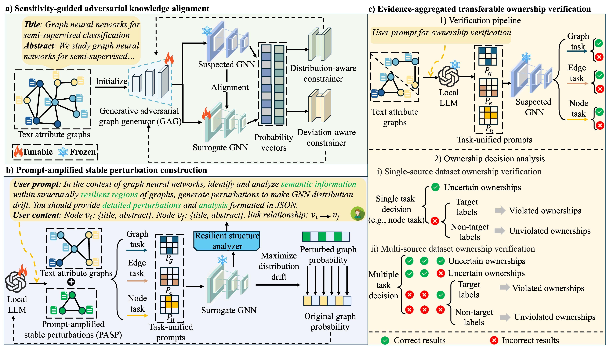
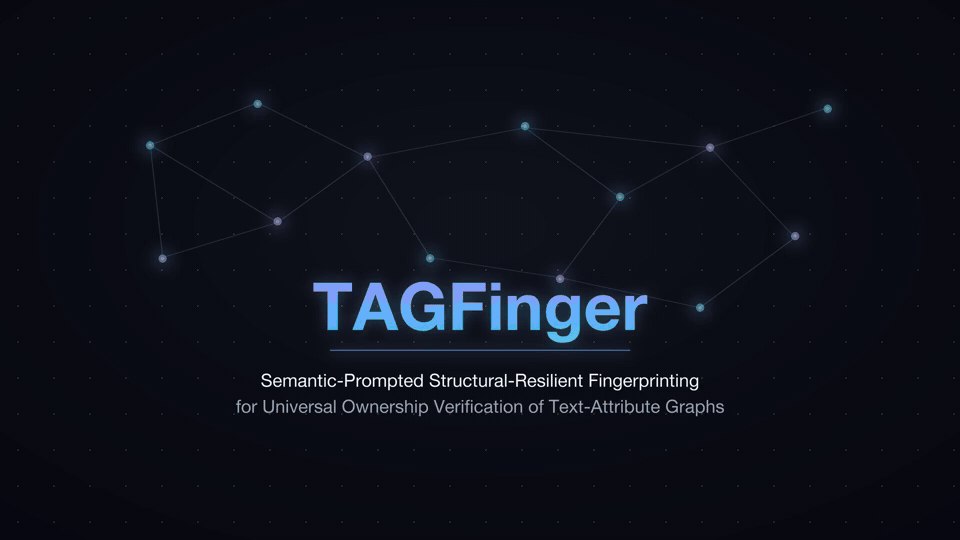

# TAGFinger

**TAGFinger: Semantic-Prompted Structural-Resilient Fingerprinting for Universal Ownership Verification of Text-Attribute Graphs**

TAGFinger is a **non-intrusive dataset ownership verification (DOV) framework** for **text-attribute graphs (TAGs)**.
Instead of relying on task-specific triggers, TAGFinger profiles fingerprints from the **inherent semantics and structures** of datasets, so that ownership can be verified across **diverse datasets, tasks, and GNN architectures** under fully black-box access.

This repository provides the official implementation of TAGFinger, including surrogate GNN alignment, LLM-based stable perturbation generation, and the universal verification protocol.

---

## 🔍 Motivation

Text-attribute graphs are expensive to collect and curate, yet they are increasingly reused without authorization.
Existing DOV methods typically:

- Depend on **task-specific triggers** tightly coupled to a single dataset and objective
- Fail under **multi-source training** (datasets mixed from different domains)
- Break when the **task or architecture changes**

TAGFinger addresses these limitations with semantic-prompted structural-resilient fingerprints that are:

- **Harmless**: no modification to the protected dataset
- **Universal**: effective across node-, edge-, and graph-level tasks
- **Robust**: stable under pruning, outlier detection, and backdoor defenses
- **Transferable**: consistent across popular GNN architectures

---

## 🧠 Method Overview

TAGFinger consists of three main components:

1. **Sensitivity-Guided Adversarial Knowledge Alignment (SAKA)**
   - A generative adversarial graph (GAG) generator actively exposes predictive discrepancies
   - A distribution-aware constrainer (DAC) and a deviation-aware constrainer (DVC) align the surrogate GNN with the decision boundary of the black-box suspected model
2. **Prompt-Amplified Stable Perturbation (PASP) Construction**
   - Identify structurally resilient regions via stability scores
   - Use an LLM with custom user contexts to generate semantic-preserving perturbations that induce consistent distribution drift
3. **Evidence-Aggregated Transferable Ownership Verification**
   - Task-unified prompts (TUP) reformulate disparate verification objectives into a shared graph representation space
   - Task-level evidence is aggregated to confirm ownership under both single-source and multi-source settings

<p align="center">
  
</p>

## 🎬 Video Overview

<p align="center">
  
</p>

> The full 3-minute narrated video is available at [`images/TAGFinger_Overview.mp4`](images/TAGFinger_Overview.mp4).

---

## 📁 Repository Structure

```text
TAGFinger/
├── data/           # Dataset loading, graph splitting, and induced-graph utilities
├── evaluation/     # Evaluation protocols for different prompt/task settings
├── images/         # Schematics and demo materials
├── llm/            # LLM perturbation generation (prompt templates, LoRA fine-tuning)
├── model/          # GNN backbones (GCN/GAT/GIN/GraphSAGE, etc.) and surrogate training
├── pretrain/       # Pre-training strategies (DGI, GraphCL, GraphMAE, SimGRACE, etc.)
├── prompt/         # Graph prompt implementations, including task-unified prompts
├── tasker/         # Node-/edge-/graph-level task adaptation
├── utils/          # Preprocessing, metrics, and configuration utilities
├── clean_data..py  # Data cleaning and format conversion
├── ours.py         # Main entry (fingerprint construction and verification pipeline)
└── README.md
```

---

## 🚀 Quick Start

### Requirements

- Python 3.9+
- PyTorch
- PyTorch Geometric
- scikit-learn, numpy

### Run

```bash
# Fingerprint construction and ownership verification
python ours.py --dataset Cora --model GCN

# Options
#   --dataset        {Cora, Citeseer, PubMed, Flickr}
#   --model          {GCN, GAT, GraphSage, GIN}   suspected GNN
#   --surrogate_model {GCN, GAT, GraphSage, GIN}  surrogate GNN
#   --total_select   number of fingerprint target nodes
#   --topk_stable    top-k stable neighbors forming each stable region
#   --lam            trade-off coefficient of the distribution drift term
#   --llm_path       local LLM (e.g., Qwen3-8B) for PASP text generation
```

LoRA fine-tuning for the LLM perturbation generator is provided in `llm/train_lora.py`.

---

## 📊 Main Results

- Verification accuracy **above 95.4%** across representative TAG datasets
- **Above 93.2%** accuracy under various attacks (vs. 36.3% of competitive baselines on Reddit)
- **Above 93.5%** accuracy when transferring across popular GNN architectures

---

## 📄 License

This repository is released for research purposes only.
